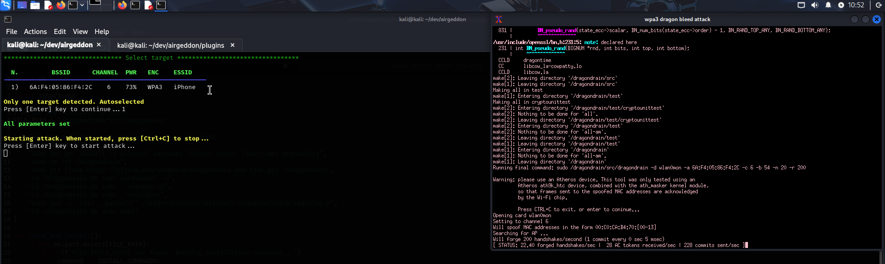

# WPA3 Dragon Drain - airgeddon plugin
WPA3 Dragon Drain attack packaged as [airgeddon] plugin

## How Dragon Drain works
Dragon Drain is a Denial of Service (DoS) technique that overwhelms vulnerable WPA3 access points by flooding them with large numbers of resource-intensive SAE (Simultaneous Authentication of Equals) commit messages. The surge in traffic exhausts the AP’s processing resources, causing legitimate clients to be dropped and preventing new associations. This weakness primarily affects first-generation WPA3 routers and any devices that have not yet been patched against the Dragonblood family of vulnerabilities. Even on vulnerable devices, the effect may take a few minutes to appear, as the access point gradually degrades while processing the excessive volume of authentication packets.

## What does this plugin do
This plugin gets Dragon Drain from original GitHub repository, edits, compiles and runs it integrated as a menu option in [airgeddon].

## Warnings & Compatibility
- Only some WPA3 access points are affected. Since this attack was discovered some time ago, most APs have already been patched against it. Therefore, if you are unsuccessful, the main reason could be that the access point is not vulnerable.
- This plugin is designed only for Debian based Linux distributions as the installation/compilation part is using `apt` command.
- The original attack is only compatible with specific wireless adapters (mostly Atheros), but this version has been modified to work with all chipsets.

## How to install it
Deploy the `.sh` and the `.py` files inside your airgeddon's plugins dir. Depending on your Linux distribution it can be in different directories. Usually is at `/usr/share/airgeddon` or maybe in another location where you did the git clone command. 

```
~/airgeddon# tree
.
├── airgeddon.sh
├── known_pins.db
├── language_strings.sh
└── plugins
    ├── wpa3_dragon_drain_attack.py
    └── wpa3_dragon_drain.sh
```

## How to run it
Select the WPA3 Dragon Drain attack from the WPA3 attacks menu in [airgeddon]. Scan for available WPA3 targets and choose one to proceed. Follow the on-screen instructions. If the Dragon Drain binary is not already compiled, the plugin will automatically compile it for you.

> ⚠️ **Note:** The first time you run the plugin, an Internet connection is required. The plugin will install the necessary dependencies, download the original Dragon Drain tool from its official repository, and compile it. Once this initial setup is complete, no Internet connection is needed for future uses.

Once launched, the attack will run indefinitely until you press Ctrl+C or close the attack window. It performs a denial-of-service (DoS) attack against the selected target, primarily affecting outdated or unpatched WPA3 access points and routers.

This is how it should look like:

 

## Credits
 - Thanks to Mathy Vanhoef for discovering the flaw. Original repository: https://github.com/vanhoefm/dragondrain-and-time
 - Thanks to [OscarAkaElvis] for his help in the development of the plugin

## TODO List
 - Do the final review of the language strings by native speaker translators
 - Test using more wireless adapters

[airgeddon]: https://github.com/v1s1t0r1sh3r3/airgeddon
[VIF]: https://github.com/v1s1t0r1sh3r3/airgeddon/wiki/FAQ%20&%20Troubleshooting#what-is-vif
[OscarAkaElvis]: https://github.com/OscarAkaElvis
