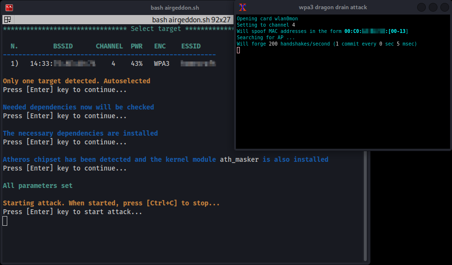

# Dragon-Bleed-WPA3-Airgeddon-Plugin
Dragon Bleed attack packaged as Airgeddon Plugin

# How Dragon Bleed works
Dragon bleed attack overflows WPA3 routers by sending heavy requests in large amount.

# What does this plugin do
This plugin checks out dragon bleed from GIT, edits it, compiles it and runs it.

# Warnings
It works only on Kali Linux with ALFA AWUS036ACM adapter. It does not re-attempt to compile if something failed in the first go. First compilation could take a while. 

# How to install
Just copy both files to plugins folder in airgeddon and chmod them to 777.

# How to run
Select Dragon Bleed attack option from Airgeddon menu and select the WPA target.

This is how it should look like:

 

# TODO List
Translate messages to other languages.